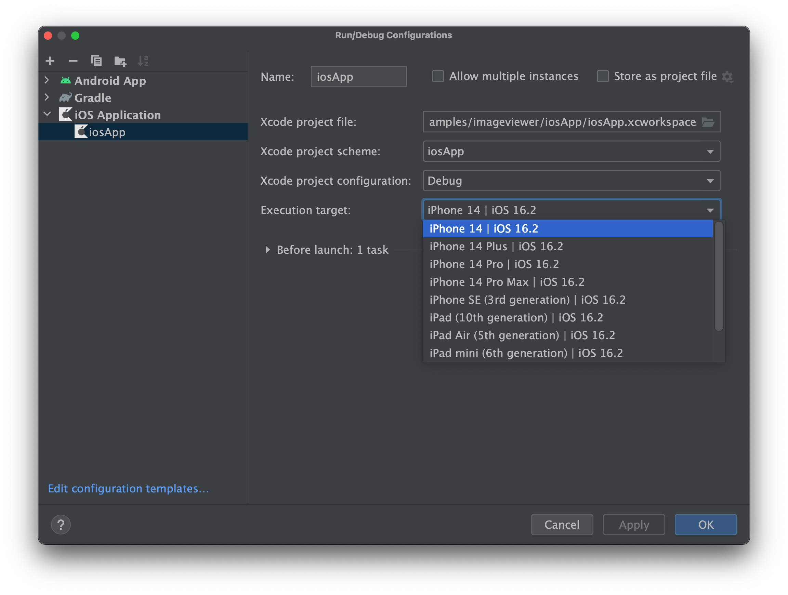
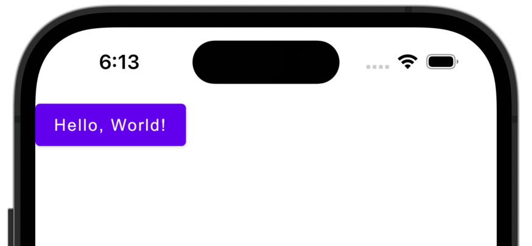

## MixDrinks app

Даний додаток ще не є готовим до продакшну, але доступний для відкритого бета-тестування в Google
Play.

В додатка є відритий beta тест в google play. (В нього попадаються нічні зробки)

- [Android](https://play.google.com/store/apps/details?id=org.mixdrinks.app)
- [Web](https://play.google.com/apps/testing/org.mixdrinks.app)

## Перед роботою з проектом

> **Warning**
> Writing and running iOS-specific code for a simulated or real device requires macOS. This is an
> Apple limitation.

Підготовка до роботи з проектом
Для роботи з проектом вам знадобляться:

- Комютер з актуальною версією macOs
- [Xcode](https://developer.apple.com/xcode/)
- [Android Studio](https://developer.android.com/studio)
- [Kotlin Multiplatform Mobile plugin](https://plugins.jetbrains.com/plugin/14936-kotlin-multiplatform-mobile)
- [CocoaPods](https://kotlinlang.org/docs/native-cocoapods.html)

### Це все можна перевірити через `kdoctor`

**Before opening the project in Android Studio**, use [`kdoctor`](https://github.com/Kotlin/kdoctor)
to ensure your development environment is configured correctly. Install `kdoctor`
via [`brew`](https://brew.sh/):

```
brew install kdoctor
```

Якщо щось пішло не так, kdoctor надасть вам список помилок:

```
Environment diagnose (to see all details, use -v option):
[✓] Operation System
[✓] Java
[✓] Android Studio
[✓] Xcode
[✓] Cocoapods

Conclusion:
  ✓ Your system is ready for Kotlin Multiplatform Mobile Development!
```

Переконайтеся, що встановлений
плагін [Kotlin Multiplatform Mobile](https://plugins.jetbrains.com/plugin/14936-kotlin-multiplatform-mobile)

## Струкутура проекту

Для перегляду структури проекту використовуйте Project view.

В проекті є три модулі:

### `shared`

Цей модуль містить код, який буде спільним для всіх платформ.

App `@Composable` фукція знаходиться в `shared/src/commonMain/kotlin/App.kt`.

### `androidApp`

Цей модуль містить код, який буде використовуватись тільки в Android.

### `iosApp`

Цей модуль містить код, який буде використовуватись тільки в iOS.
Модуль `iosApp` залежить від `shared` модуля як від CocoaPods залежності.

## Запуск проекту

## Android

Виберіть конфігурацію `androidApp` -> `Run`

Gradle
`./gradlew installDebug`

## iOS

We suggest going through the "Hello, World" steps of creating and deploying a sample project in
Xcode to a simulator and/or your physical device.
A video tutorial for setting up Xcode and running your first "Hello, World" application is available
in [this Standford CS193P lecture recording](https://youtu.be/bqu6BquVi2M?start=716&end=1399).

### Running on an iOS simulator

Once you have configured your environment correctly, you will be able to select which iOS simulator
to run your application in Android Studio on by modifying the `iosApp` run configuration.

Select "Run" | "Edit Configurations..." and navigate to the "iOS Application" | "iosApp" run
configuration. In the "Execution target" drop-down, select your target device.




Press the "Run" button to run your Compose Multiplatform app on the iOS simulator.



### Running on a real iOS device

Running your Compose Multiplatform application on a physical device can be done for free. You need:

- an [Apple ID](https://support.apple.com/en-us/HT204316)
- the registered iOS device in Xcode

Before you continue, make sure that you can successfully run a plain "Hello, World" application from
Xcode on your physical device.

To run the application, set the `TEAM_ID` associated with your Apple ID
in `iosApp/Configuration/Config.xcconfig`.

#### Finding your Team ID

Use `kdoctor --team-ids` to find and set your Team ID. This will list all Team IDs currently
configured on your system, for example:

```
3ABC246XYZ (Max Sample)
ZABCW6SXYZ (SampleTech Inc.)
```

<details>
<summary>Alternative way of finding your Team ID</summary>

If you're running into trouble with the method described above, you can try this alternative method.

- Run the `iosApp` run configuration from Android Studio (it will fail)
- Open the `iosApp/iosApp.xcworkspace` in Xcode
- Select `iosApp` in the menu on the left side
- Navigate to "Signing & Capabilities"
- Select your Personal Team in the "Team" dropdown. If you haven't set up your team, use the "Add
  account..." option and follow the steps inside Xcode.

</details>

Set this Team ID in `iosApp/Configuration/Config.xcconfig` in the `TEAM_ID` field.

After that you can re-open the project in Android Studio, and it will show the registered iOS device
in the `iosApp`
run configuration.
